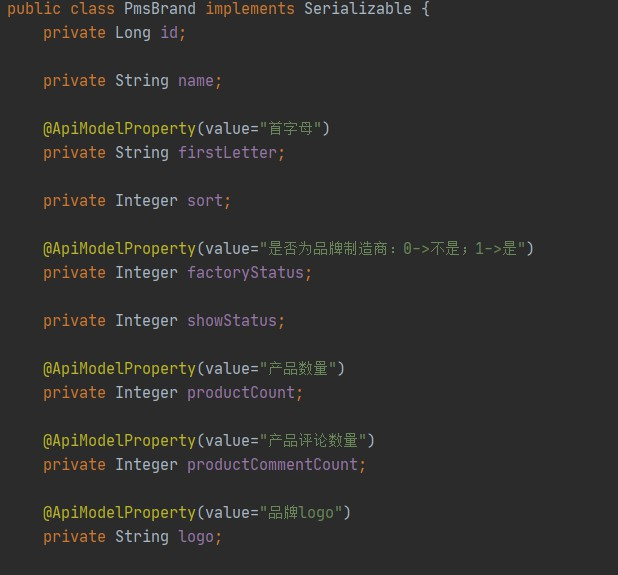
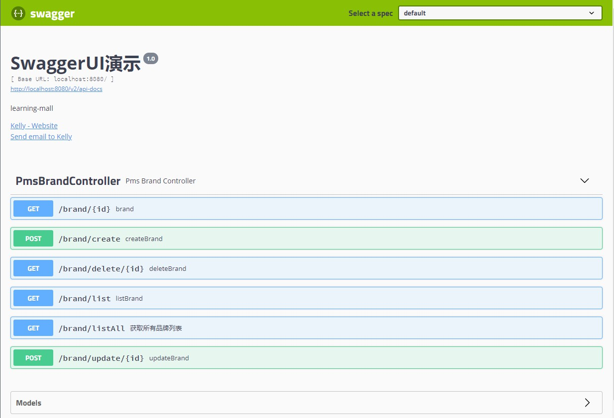
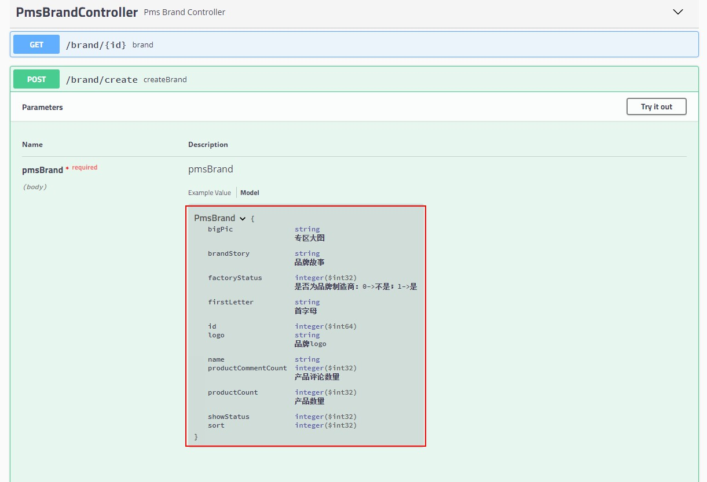
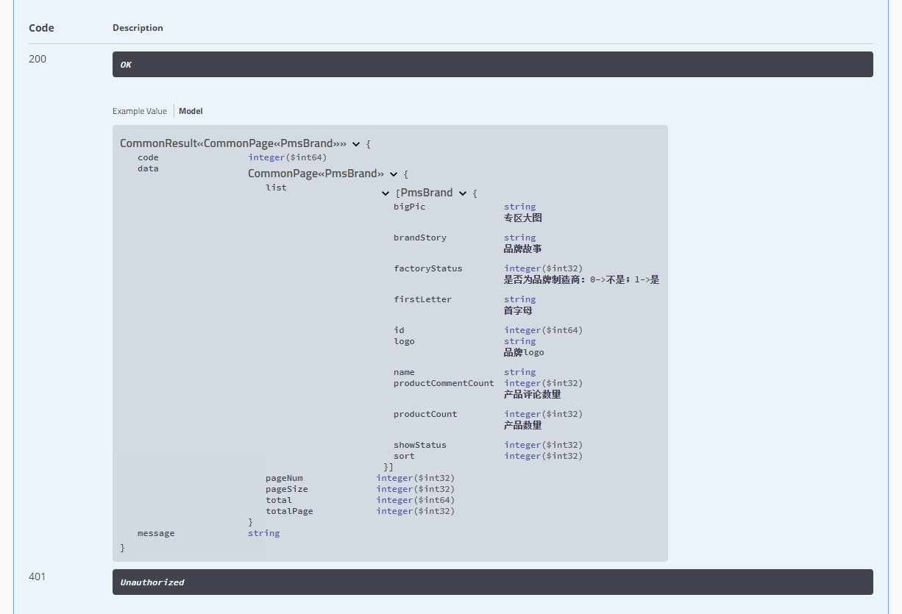
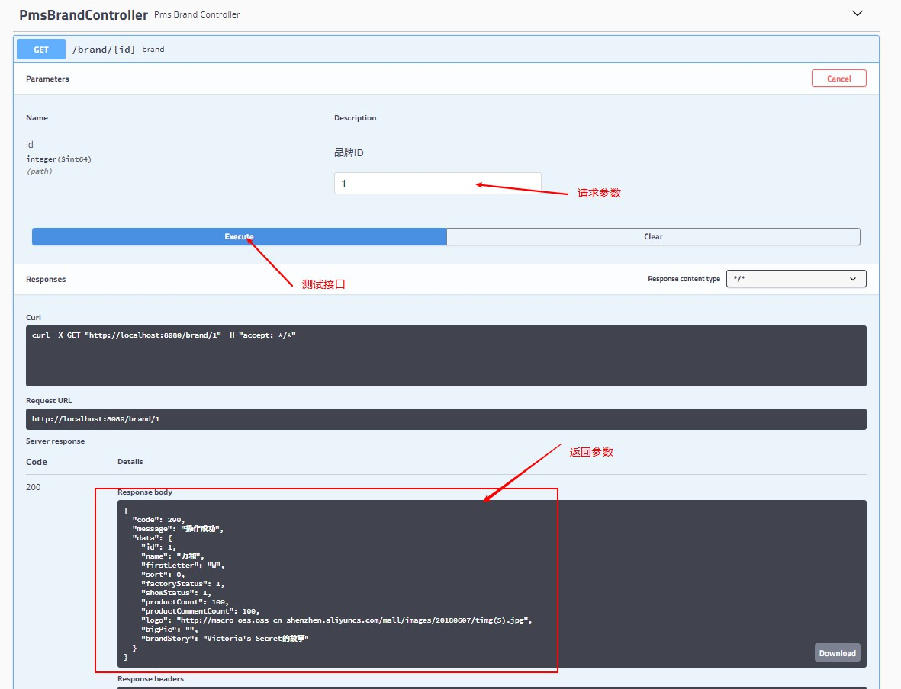

# mall整合Swagger-UI实现在线API文档
> 本文主要讲解mall是如何通过整合Swagger-UI来实现一份相当完善的在线API文档的。

## 项目使用框架介绍
### Swagger-UI
> Swagger-UI是HTML, Javascript, CSS的一个集合，可以动态地根据注解生成在线API文档。

### 常用注解
* @Api：用于修饰Controller类，生成Controller相关文档信息
* @ApiOperation：用于修饰Controller类中的方法，生成接口方法相关文档信息
* @ApiParam：用于修饰接口中的参数，生成接口参数相关文档信息
* @ApiModelProperty：用于修饰实体类的属性，当实体类是请求参数或返回结果时，直接生成相关文档信息

## 整合Swagger-UI
### 添加项目依赖
> 在pom.xml中新增Swagger-UI相关依赖
```xml
<!--        Swagger UI API文档工具-->
    <dependency>
        <groupId>io.springfox</groupId>
        <artifactId>springfox-swagger2</artifactId>
        <version>2.9.2</version>
    </dependency>
    <dependency>
        <groupId>io.springfox</groupId>
        <artifactId>springfox-swagger-ui</artifactId>
        <version>2.9.2</version>
    </dependency>
```

### 添加Swagger-UI的配置
> 添加Swagger-UI的Java配置文件
  
注意：Swagger对生成API文档的范围有三种不同的选择
* 生成指定包下面的类的API文档
* 生成有指定注解的类的API文档
* 生成有指定注解的方法的API文档

```java
package com.example.mall.learning.config;

import org.springframework.context.annotation.Bean;
import org.springframework.context.annotation.Configuration;
import springfox.documentation.builders.ApiInfoBuilder;
import springfox.documentation.builders.PathSelectors;
import springfox.documentation.builders.RequestHandlerSelectors;
import springfox.documentation.service.ApiInfo;
import springfox.documentation.service.Contact;
import springfox.documentation.spi.DocumentationType;
import springfox.documentation.spring.web.plugins.Docket;
import springfox.documentation.swagger2.annotations.EnableSwagger2;

@Configuration
@EnableSwagger2
public class Swagger2Config {
    @Bean
    public Docket createResApi() {
        return new Docket(DocumentationType.SWAGGER_2)
                .apiInfo(apiInfo())
                .select()
                .apis(RequestHandlerSelectors.basePackage("com.example.mall.learning.controller"))
                .paths(PathSelectors.any())
                .build();
    }

    private ApiInfo apiInfo() {
        Contact contact = new Contact("Kelly", "www.xxx.com", "xxxx@xx.com");
        return new ApiInfoBuilder()
                .title("SwaggerUI演示")
                .description("learning-mall")
                .contact(contact)
                .version("1.0")
                .build();
    }
}
```

### 给PmsBrandController添加Swagger注解
> 给原有的品牌管理Controller添加上Swagger注解
  
```java
package com.example.mall.learning.controller;

import com.example.mall.learning.common.api.CommonPage;
import com.example.mall.learning.common.api.CommonResult;
import com.example.mall.learning.mbg.model.PmsBrand;
import com.example.mall.learning.service.PmsBrandService;
import io.swagger.annotations.Api;
import io.swagger.annotations.ApiOperation;
import io.swagger.annotations.ApiParam;
import org.slf4j.Logger;
import org.slf4j.LoggerFactory;
import org.springframework.beans.factory.annotation.Autowired;
import org.springframework.stereotype.Controller;
import org.springframework.web.bind.annotation.*;

import java.util.List;

@Api(tags={"PmsBrandController"}, value = "商品品牌管理")
@Controller
@RequestMapping("/brand")
public class PmsBrandController {
    @Autowired
    private PmsBrandService demoService;

    private static final Logger LOGGER = LoggerFactory.getLogger(PmsBrandController.class);

    @ApiOperation("获取所有品牌列表")
    @RequestMapping(value = "listAll", method = RequestMethod.GET)
    @ResponseBody
    public CommonResult<List<PmsBrand>> getBrandList() {
        List<PmsBrand> brandList = demoService.listAllBrand();
        return CommonResult.success(brandList);
    }

    @RequestMapping(value = "/create", method = RequestMethod.POST)
    @ResponseBody
    public CommonResult createBrand(@RequestBody PmsBrand pmsBrand) {
        CommonResult commonResult;
        int count = demoService.createBrand(pmsBrand);
        if (count == 1) {
            commonResult = CommonResult.success(pmsBrand);
        } else {
            commonResult = CommonResult.failed("操作失败");
        }
        LOGGER.debug("create Brand " + (count == 1 ? "success" : "failed") + ":{}", pmsBrand);
        return commonResult;
    }

    @RequestMapping(value = "/update/{id}", method = RequestMethod.POST)
    @ResponseBody
    public CommonResult updateBrand(@PathVariable("id") @ApiParam("品牌ID") Long id, @RequestBody PmsBrand pmsBrand) {
        CommonResult commonResult;
        int count = demoService.updateBrand(id, pmsBrand);
        commonResult = count == 1 ? CommonResult.success(pmsBrand) : CommonResult.failed("操作失败");
        LOGGER.debug("update Brand " + (count == 1 ? "success" : "failed") + ":{}", pmsBrand);
        return commonResult;
    }

    @RequestMapping(value = "/delete/{id}", method = RequestMethod.GET)
    @ResponseBody
    public CommonResult deleteBrand(@PathVariable("id") @ApiParam("品牌ID") Long id) {
        int count = demoService.deleteBrand(id);
        boolean isSuccess = count == 1;
        LOGGER.debug("delete Brand " + (isSuccess ? "success" : "failed") + ":id={}", id);
        return isSuccess ? CommonResult.success(null) : CommonResult.failed("操作失败");
    }

    @RequestMapping(value = "/list", method = RequestMethod.GET)
    @ResponseBody
    public CommonResult<CommonPage<PmsBrand>> listBrand(@RequestParam(value = "pageNum", defaultValue = "1") Integer pageNum, @RequestParam(value = "pageSize", defaultValue = "10") Integer pageSize) {
        List<PmsBrand> brandList = demoService.listBrand(pageNum, pageSize);
        return CommonResult.success(CommonPage.resetPage(brandList));
    }

    @RequestMapping(value = "/{id}", method = RequestMethod.GET)
    @ResponseBody
    public CommonResult<PmsBrand> brand(@PathVariable("id") @ApiParam("品牌ID") long id) {
        return CommonResult.success(demoService.getBrand(id));
    }
}
```

### 修改MyBatis Generator注释的生成规则
> CommentGenerator为MyBatis Generator的自定义注释生成器，修改addFieldComment方法使其生成Swagger的@ApiModelProperty注解来取代原来的方法注释，添加addJavaFileComment方法，使其能在import中导入@ApiModelProperty，否则需要手动导入该类，在需要生成大量实体类时，是一件非常麻烦的事。
  
```java
package com.example.mall.learning.mbg;

import org.mybatis.generator.api.IntrospectedColumn;
import org.mybatis.generator.api.IntrospectedTable;
import org.mybatis.generator.api.dom.java.CompilationUnit;
import org.mybatis.generator.api.dom.java.Field;
import org.mybatis.generator.api.dom.java.FullyQualifiedJavaType;
import org.mybatis.generator.internal.DefaultCommentGenerator;
import org.mybatis.generator.internal.util.StringUtility;

import java.util.Properties;

public class CommentGenerator extends DefaultCommentGenerator {
    private boolean addRemarkComments = false;
    private static final String EXAMPLE_SUFFIX="Example";
    private static final String API_MODEL_PROPERTY_FULL_CLASS_NAME="io.swagger.annotations.ApiModelProperty";

    /**
     * 设置用户配置的参数
     */
    @Override
    public void addConfigurationProperties(Properties properties) {
        super.addConfigurationProperties(properties);
        this.addRemarkComments = StringUtility.isTrue(properties.getProperty("addRemarkComments"));
    }

    /**
     * 给字段添加注释
     */
    @Override
    public void addFieldComment(Field field, IntrospectedTable introspectedTable,
                                IntrospectedColumn introspectedColumn) {
        String remarks = introspectedColumn.getRemarks();
        //根据参数和备注信息判断是否添加备注信息
        if (addRemarkComments && StringUtility.stringHasValue(remarks)) {
//            addFieldJavaDoc(field, remarks);
            if (remarks.contains("\"")) {
                remarks = remarks.replace("\"", "'");
            }
            field.addJavaDocLine("@ApiModelProperty(value=\"" + remarks + "\")");
        }
    }

    /**
     * 给model的字段添加注释
     */
    private void addFieldJavaDoc(Field field, String remarks) {
        //文档注释开始
        field.addJavaDocLine("/**");
        //获取数据库字段的备注信息
        String[] remarkLines = remarks.split(System.getProperty("line.separator"));
        for (String remarkLine : remarkLines) {
            field.addJavaDocLine(" * " + remarkLine);
        }
        addJavadocTag(field, false);
        field.addJavaDocLine(" */");
    }

    @Override
    public void addJavaFileComment(CompilationUnit compilationUnit) {
        super.addJavaFileComment(compilationUnit);
        compilationUnit.addImportedType(new FullyQualifiedJavaType(API_MODEL_PROPERTY_FULL_CLASS_NAME));
    }
}
```

### 运行代码生成器重新生成mbg包中的代码
> 运行com.macro.mall.tiny.mbg.Generator的main方法，重新生成mbg中的代码，可以看到PmsBrand类中已经自动根据数据库注释添加了@ApiModelProperty注解
 


### 运行项目，查看结果

接口地址：http://localhost:8080/swagger-ui.html


### 对请求参数已经添加说明


### 对返回结果已经添加说明


### 直接在在线文档上面进行接口测试


## 项目源码地址
https://github.com/mmmy/learning-mall/tree/main/learning-mall-02